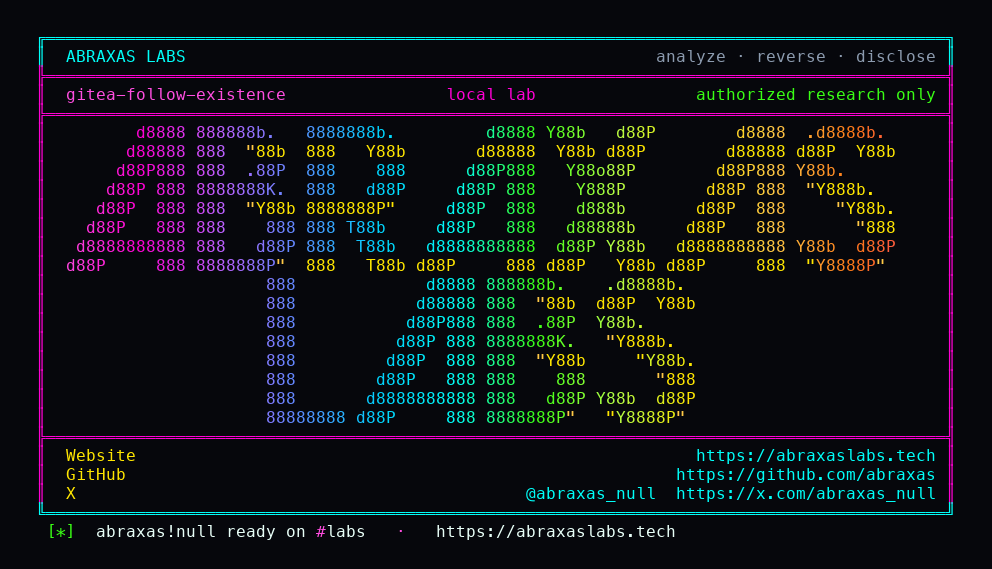

<p align="center">
  
</p>

<p align="center">
  <a href="https://abraxaslabs.tech"><strong>abraxaslabs.tech</strong></a>
  &nbsp;·&nbsp;
  <a href="https://github.com/abraxas">github.com/abraxas</a>
  &nbsp;·&nbsp;
  <a href="https://x.com/abraxas_null">@abraxas_null</a>
  &nbsp;·&nbsp;
  <a href="mailto:abraxas.null@proton.me">abraxas.null@proton.me</a>
  &nbsp;·&nbsp;
  <a href="https://github.com/abraxas/gitea-follow-existence">gitea-follow-existence</a>
</p>

# gitea-follow-existence

**Gitea** `1.27.3` - Gitea

[`GetInfo`](https://github.com/go-gitea/gitea/blob/v1.27.3/routers/api/v1/user/user.go) already 404s hidden users and lies about why: `fake ErrUserNotExist error message to not leak information about existence`. [`PUT /user/following/{username}`](https://github.com/go-gitea/gitea/blob/v1.27.3/routers/api/v1/api.go) loads the target with `UserAssignmentAPI()` and calls [`Follow`](https://github.com/go-gitea/gitea/blob/v1.27.3/routers/api/v1/user/follower.go). No `IsUserVisibleToViewer`. Missing name: 404 `user redirect does not exist`. Hidden name that exists: **204**.

**204 means the account exists. 404 means you guessed a name that is not there. The profile JSON stays closed.**

| | |
|---|---|
| ID | no CVE yet |
| CWE | [CWE-203](https://cwe.mitre.org/data/definitions/203.html) |
| CVSS | **Medium: 4.3** `CVSS:3.1/AV:N/AC:L/PR:L/UI:N/S:U/C:L/I:N/A:N` |
| Product | [Gitea](https://github.com/go-gitea/gitea) |
| Affected | through **v1.27.3** (`146cc3e`) |
| Auth | signed-in account |
| License | [GNU Affero GPL v3.0](LICENSE) |
| Lab | `127.0.0.1` only |

## What an attacker can do

Sign in (default open registration is cheap). Prove a hidden or limited account **exists** even when the profile API 404s. No profile dump. No private git. Combined with [unauth stargazers](https://github.com/abraxas/gitea-stargazers-hidden), you can find a hidden login on a public repo and then confirm it still exists after they hide the profile.

Check and Unfollow sit on the same group. Same missing check.

## How I found it

Same visibility pass as [stargazers](https://github.com/abraxas/gitea-stargazers-hidden). When a handler works that hard to lie, you look at every other route that takes `{username}`. Follow does not.

I registered a restricted attacker, followed the hidden name, followed a name that does not exist, and compared status codes. Public users are supposed to 204. That is not SUCCESS. Hidden 204 vs unknown 404 while GET is 404 is SUCCESS.

Wrong turns already recorded: Follow hidden returning 404 (then visibility is on this route); profile JSON for the hidden user (`GetInfo` already 404s - this bug is status class, not a dump); treating Follow 204 on a public user as SUCCESS; a reverse shell. Theatre.

## Lab

```bash
cd lab
./run.sh
```

Target **only** `http://127.0.0.1:18134`. Compose allows `public,limited,private` visibility.

```text
get-hidden status=404
follow-hidden status=204
follow-unknown status=404 user redirect does not exist
oracle hidden=204 unknown=404
SUCCESS GITEA-FOLLOW-ORACLE
```

## The fix

Call `IsUserVisibleToViewer` in `Follow` (and Check/Unfollow) before `FollowUser`. Hidden names must 404 the same way `GetInfo` already does.

## References

- [github.com/go-gitea/gitea](https://github.com/go-gitea/gitea) tag [v1.27.3](https://github.com/go-gitea/gitea/releases/tag/v1.27.3)
- [`follower.go`](https://github.com/go-gitea/gitea/blob/v1.27.3/routers/api/v1/user/follower.go) · [`api.go` following group](https://github.com/go-gitea/gitea/blob/v1.27.3/routers/api/v1/api.go) · [`GetInfo`](https://github.com/go-gitea/gitea/blob/v1.27.3/routers/api/v1/user/user.go)
- Same tag: [gitea-stargazers-hidden](https://github.com/abraxas/gitea-stargazers-hidden)
- [CWE-203](https://cwe.mitre.org/data/definitions/203.html)

## License

GNU Affero GPL v3.0. See [LICENSE](LICENSE). Loopback lab only. No warranty.
